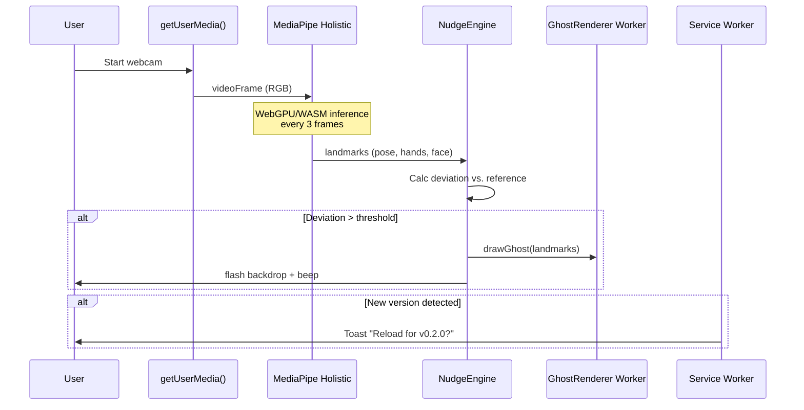

# ShadowNudge SDLC Architecture
**Version**: 0.1.0-MVP  
**Target**: Desktop/laptop browsers only (Chrome 90+)  
**Privacy**: Zero telemetry, pure local-first

## Project Structure

```
shadow-nudge/
├── public/                      # Static assets served by Cloudflare Pages
│   ├── models/                  # Pre-downloaded ML models (SW cached)
│   │   ├── holistic-lite.bin    # MediaPipe Holistic lite variant (~4MB)
│   │   └── holistic-full.bin    # Full accuracy variant (~12MB)
│   ├── sw.js                    # Service Worker (caching + semver)
│   └── index.html               # Single-page app shell
├── src/
│   ├── core/
│   │   ├── detector.ts          # MediaPipe Holistic inference wrapper
│   │   ├── reference-store.ts   # IndexedDB for pose snapshots
│   │   └── nudge-engine.ts      # Deviation detection & alert logic
│   ├── workers/
│   │   └── ghost-renderer.ts    # OffscreenCanvas ghost outline rendering
│   └── main.ts                  # App bootstrap, SW registration, mobile gate
├── wrangler.toml               # Cloudflare Pages deployment config
├── package.json                # Version drives SW updates
└── README.md
```

---

## Commit Conventions

Use Conventional Commits with a simple `type: message` format, no scope and no commit body.
Examples:
- `docs: first commit`
- `feat: add nudge engine`
- `fix: handle mobile user agent edge case`

## Core Technologies

### **MediaPipe Holistic (C++/WASM)**
**Why**: Runs pose (33 landmarks), hands (21 points each), and face mesh tracking at 60-90 FPS entirely in-browser. The WASM binary is compiled from C++ source, not TypeScript or Rust. While Rust wrappers exist (e.g., WasmEdge/mediapipe-rs), MediaPipe's official JavaScript API uses a custom C++ WASM binary for maximum performance.

**Implementation**:
```typescript
import { Holistic } from '@mediapipe/holistic';

const holistic = new Holistic({
  locateFile: (file) => `/models/${file}` // Host locally, bypass CDN
});

holistic.setOptions({
  modelComplexity: 1,        // 0=lite, 1=full, 2=heavy (start with 1)
  delegate: 'GPU',          // Chrome 113+: WebGPU | Fallback: WASM
  smoothLandmarks: true      // Reduces jitter, crucial for long sessions
});
```

**WASM Backend**: Chrome 90+, Edge 90+, Firefox 88+. Safari 15+ supports WASM but MediaPipe WebGPU requires Chrome/Edge.

### **WebGPU Acceleration (Chrome 113+ Required)**
- **Performance**: 3-10x faster inference vs WASM by offloading model execution to GPU compute shaders
- **Fallback**: Automatically degrades to WASM if WebGPU unavailable
- **Resource Impact**: GPU memory ~100-200MB persistent allocation; negligible CPU usage once initialized

### **OffscreenCanvas for Ghost Rendering**
Move ghost outline drawing to a dedicated worker thread to avoid blocking main UI during long monitoring sessions:

```typescript
// In main.ts
const canvas = document.querySelector('canvas');
const offscreen = canvas.transferControlToOffscreen();
const worker = new Worker('./workers/ghost-renderer.ts', { type: 'module' });
worker.postMessage({ canvas: offscreen }, [offscreen]);

// In ghost-renderer.ts
self.onmessage = (event) => {
  const canvas = event.data.canvas;
  const ctx = canvas.getContext('2d');
  // Render ghost outline here, decoupled from main thread
};
```

---

## Performance & Resource Management

### **Long-Running Session Optimizations**

1. **Frame Decimation**: Process every 3rd frame (90ms interval). Human posture changes slower than 110ms reaction time; this reduces GPU/CPU load by 66%.

2. **Model Complexity Runtime Toggle**:
   ```typescript
   // Later UI setting: accuracy vs. performance
   function setModelLevel(level: 0 | 1 | 2) {
     holistic.setOptions({ modelComplexity: level });
     // 0=Lite (4MB, 30 FPS), 1=Full (8MB, 45 FPS), 2=Heavy (12MB, 60 FPS)
   }
   ```

3. **GPU Memory Leak Prevention**: Call `holistic.close()` on page unload to release WebGPU textures. Chrome's Graphics Memory footprint can grow unbounded otherwise.

4. **Worker Thread Isolation**: MediaPipe inference runs on main thread (WebGPU requires it), but all ghost rendering, alert logic, and IndexedDB writes happen in workers.

5. **Battery API Throttling**: When `navigator.getBattery().level < 0.2`, auto-switch to `modelComplexity: 0` and 5-second frame intervals.

### **Initialization Overhead**
- First load: ~30s model download + WASM compilation (Chrome freezes briefly). Service Worker caches this aggressively.
- Subsequent loads: <2s from cache. WebGPU context initialization adds ~500ms.

---

## Data Flow



---

## Mobile Detection (Hard Gate)

```typescript
// src/main.ts - Run before ANY asset loading
const isMobile = /mobi|android|iphone|ipad|ipod|blackberry|iemobile|opera mini/i.test(
  navigator.userAgent.toLowerCase()
);

if (isMobile) {
  document.body.innerHTML = `
    <div class="mobile-block">
      <h1>ShadowNudge requires a stable webcam</h1>
      <p>Desktop/laptop only. Mobile devices not supported.</p>
      <small>Mobile user agent detected: ${navigator.userAgent}</small>
    </div>
  `;
  throw new Error('Mobile device blocked');
}
```
MDN recommends this UA substring check as most reliable client-side method.

---

## Service Worker & Version Management

```javascript
// public/sw.js
const PACKAGE_VERSION = '__PACKAGE_VERSION__'; // Replaced at build time

self.addEventListener('install', event => {
  event.waitUntil(
    caches.open(`shadow-nudge-v${PACKAGE_VERSION}`).then(cache => 
      cache.addAll([
        '/',
        '/main.js',
        '/models/holistic-lite.bin'
      ])
    )
  );
});

self.addEventListener('fetch', event => {
  event.respondWith(
    caches.match(event.request).then(cached => {
      // Check version.json for updates
      if (event.request.url.endsWith('/package.json')) {
        return fetch(event.request).then(response => {
          // Post message to client if version mismatch
        });
      }
      return cached || fetch(event.request);
    })
  );
});
```

**Version Bump Workflow**:
1. Update `package.json` version field
2. Push to GitHub → Cloudflare Pages auto-builds
3. On next visit, SW fetches `package.json`, detects mismatch, shows toast
4. User accepts → `window.location.reload(true)` loads new SW cache

---

## Development Workflow

### **Local Development**
```bash
# Terminal 1: Serve with local IP for phone testing
wrangler pages dev --ip 192.168.1.x

# Terminal 2: Watch TypeScript
tsc --watch --noEmit

# Test mobile block: Open phone browser to http://192.168.1.x:8788
```

### **JavaScript runtime (Bun)**
Use Bun as the JavaScript runtime for any tooling defined in `package.json`:
```bash
bun install
bun run <script-name>
```
Replace `<script-name>` with the appropriate script from `package.json` (for example, `dev`, `build`, or `test`).

### **Hot Reload**
Add `?no-sw` query param to disable Service Worker during development: `http://localhost:8788/?no-sw`

---

## Browser Compatibility Matrix

| Feature | Chrome | Edge | Firefox | Safari |
|---------|--------|------|---------|--------|
| **MediaPipe WASM** | 90+ ✓ | 90+ ✓ | 88+ ✓ | 15+ ✓ |
| **WebGPU Backend** | 113+ ✓ | 113+ ✓ | 127+ ✓ (experimental) | 17+ ✗ (no WebGPU) |
| **OffscreenCanvas** | 69+ ✓ | 79+ ✓ | 105+ ✓ | 16.4+ ✓ |
| **getUserMedia** | 21+ ✓ | 12+ ✓ | 36+ ✓ | 11+ ✓ |

**Recommend**: Chrome 113+ for full WebGPU acceleration. Fallback to WASM-only in Firefox/Safari with performance warning.

---

## Privacy-First Checklist

- ✅ No network requests after initial load (models hosted locally)
- ✅ No analytics, telemetry, or server-side logging
- ✅ IndexedDB data stays local (never synced)
- ✅ Camera feed processed in-memory, no frames stored
- ✅ Service Worker caches only static assets, no user data
- ✅ All diagnostic traces stay local in the browser console via `console.debug`, `console.info`, `console.warn`, and `console.error`

### Local debug logging for support

When users report issues, ask them to:
1. Open their browser DevTools console
2. Reproduce the problem
3. Copy/paste the `console.debug`/`info`/`warn`/`error` output into the bug report

This preserves zero-telemetry guarantees while still enabling rich, local-only traces.

---

## References

1. MediaPipe Holistic Overview: https://github.com/google/mediapipe/blob/master/docs/solutions/holistic.md
2. MediaPipe Web WASM Implementation Details: https://github.com/google-ai-edge/mediapipe/issues/1163
3. WebGPU Browser Support: https://web.dev/blog/webgpu-supported-major-browsers
4. WebGPU ML Workload Acceleration: https://blog.logrocket.com/webgpu-accelerate-ml-workloads-browser
5. Chrome WebGPU + WASM Enhancements: https://developer.chrome.com/blog/io24-webassembly-webgpu-1
6. MediaPipe Slow Initialization Issue: https://github.com/google/mediapipe/issues/4348
7. MediaPipe C++ Source: https://github.com/google-ai-edge/mediapipe
8. MDN OffscreenCanvas API: https://developer.mozilla.org/en-US/docs/Web/API/OffscreenCanvas
9. Mobile UA Detection Best Practice: https://developer.mozilla.org/en-US/docs/Web/HTTP/Browser_detection_using_the_user_agent

---

## Implementation Roadmap

1. **Week 1**: Scaffold repo, mobile gate, Service Worker
2. **Week 2**: MediaPipe Holistic integration with WebGPU detection
3. **Week 3**: Reference pose capture & IndexedDB storage
4. **Week 4**: Deviation detection logic + background flash alerts
5. **Week 5**: Ghost rendering worker + hand-face proximity detection
6. **Week 6**: Settings panel (sensitivity, model level)
7. **Week 7**: Stress testing & battery API integration

**Critical Path**: WebGPU backend selection and graceful degradation is highest risk. Test on Intel/AMD/NVIDIA GPUs—WebGPU drivers vary.
